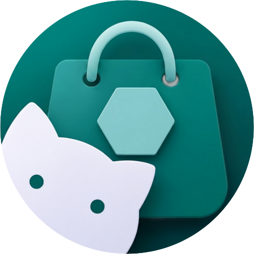

# Shizu CoreFetch

  

  <strong>An advanced, Shizuku-powered application hub and community ecosystem for Android.</strong> 
  Fetch, manage, review, and silently update your apps with system-level privileges — entirely open source.

  
  
  
  

---

## 📖 Overview

**Shizu CoreFetch** is a next‑generation application manager and store front for Android that leverages the **Shizuku** API to perform operations without requiring root access. It comes bundled with a local **APK wallet**, a centralized repository browser, an interactive **comment & reaction community**, integrated **developer portfolios**, GitHub authentication, and a non-intrusive **ad network managed via Google Apps Script** — all wrapped in a clean, modern interface that supports light/dark themes and 9 languages.

> ⚡ Perfect for power users, developers, and anyone tired of manual package management.

---

## ✨ Key Features

- **Flexible Installation Options (New)**  
  Toggle between **Silent Installation** using system-level Shizuku privileges, or standard Android package installer prompts directly from the settings panel.

- **Interactive Community Hub (New)**  
  Engage with other users by reading and writing markdown-supported comments, replying directly to feedback, and interacting using emoji reactions powered safely by GitHub Issues.

- **Smart Rating System (New)**  
  Discover top-tier apps instantly through an automated star-to-rating calculation algorithm that highlights trusted software in a dedicated **Trending Apps** section.

- **Developer Portfolios (New)**  
  Explore dedicated developer profiles inside the app. View developer bios, official websites, support emails, social links, and their entire catalog of published tools.

- **Curated Monetization Ecosystem (New)**  
  Supports beautiful, non-intrusive developer advertisements seamlessly approved and whitelisted via a robust Google Sheets panel to keep the market healthy and sustainable.

- **Optimized Guest Mode (New)**  
  Browse the store, view developer details, read changelogs, and audit version history seamlessly as a guest thanks to a dual-token fallback mechanism that bypasses GitHub Rate Limits.

- **Local Storage Wallet (Improved)**  
  Store downloaded APKs locally, share them via any app, or open them with external file viewers (such as MT Manager). Now features **accurate icon extraction** for cached packages.

- **Update Notifications**  
  Receive alerts when new versions of your installed apps become available. Background checks ensure you never miss an update.

- **Multi‑Language**  
  Available in 9 languages: العربية, English, Français, Español, Português, Русский, हिन्दी, 中文, 日本語.

- **Dynamic Theming**  
  Switch between Light, Dark, and System‑follow modes on the fly.

---

## 📱 Screenshots

  
  

---

## 📦 Requirements

- Android 8.0+ (API 26)
- [Shizuku](https://play.google.com/store/apps/details?id=moe.shizuku.privileged.api) installed and running on your device (Only required for Silent operations)
- Network permission (for fetching app data from the repository)
- Storage permission (for saving and sharing APK files)

> Root access is **not** required.

---

## 🚀 Installation

1. **Download the latest APK** from the [Releases page](https://github.com/elhizazi1/ShizuCoreFetch/releases/latest).
2. Install the APK on your Android device (you may need to allow “Install from unknown sources”).
3. Open **Shizuku** and start the service (if utilizing silent install/uninstall).
4. Launch **Shizu CoreFetch** → grant permissions, and you're good to go!

---

## 🧠 How It Works

Shizu CoreFetch bridges the gap between decentralized GitHub releases and the end-user using a high-performance serverless backend engine (Google Apps Script) coupled with native system client bindings:

graph TD
    A[GAS Backend Engine] -->|Syncs & Filters| B(Google Drive Cache)
    B -->|Serves Main Catalog Securely| C[Shizu CoreFetch App]
    C -->|Silent Mode| D{Shizuku Binder API}
    C -->|Standard Mode| E[Android OS Installer]
    D --> F[Privileged pm install/uninstall]

## 🌍 Localization
All user‑facing strings are translated into the following languages:
| Language | Status |
|---|---|
| العربية (Arabic) | ✅ Complete |
| English (en) | ✅ Complete |
| Français (French) | ✅ Complete |
| Español (Spanish) | ✅ Complete |
| Português (Portuguese) | ✅ Complete |
| Русский (Russian) | ✅ Complete |
| हिन्दी (Hindi) | ✅ Complete |
| 中文 (Chinese) | ✅ Complete |
| 日本語 (Japanese) | ✅ Complete |
## 🛠️ Tech Stack
 * Language: Kotlin
 * UI: XML Layouts + Material Design 3 Components
 * Networking: Retrofit 2 + OkHttp + GitHub REST API v3
 * Cloud Backend & Admin Panel: Google Apps Script + Google Sheets API
 * Image Loading: Coil (with crossfade and rounded transformations)
 * Rich Text Rendering: Markwon Markdown Library
 * Local Caching: Gson + Shared Preferences Architecture
## Acknowledgments & Design Assets
The user interface of Shizu CoreFetch relies on clean and professional iconography. The icons used throughout the application are sourced from the **Iconsax** library. To ensure optimal performance, crisp scaling across all screen densities, and memory efficiency on Android, all utilized icons were converted from their original formats into native Android Vector Drawable (XML) formats.
## 📜 License
This project is licensed under the MIT License – see the LICENSE file for details.
## 👤 Author & Contact
Jamal El Hizazi
 * GitHub: @elhizazi1
 * Website: Siwane.xyz

Made with ❤️ for the Android community

---
